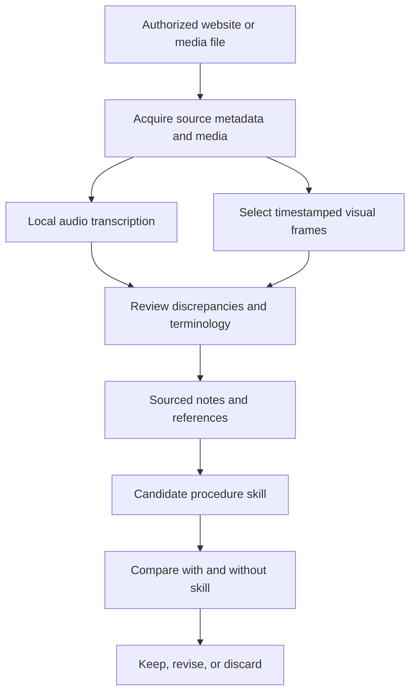

# Spike: Pi media learning and live voice

## TL;DR

- **Current priority:** move to original Pi with live voice comparable to OMP before continuing the
  course-learning pipeline. Keep OMP working until the Pi trial passes.
- **First choice: test and extend `pi-live-codex`.** It already ports OMP-style voice into Pi and uses
  Codex subscription authentication. Waldo prefers reusing his existing paid access. Account access,
  available voice hours alongside coding, and live Pi compatibility remain unverified.
- **Second choice: Orb.** More voice configuration and work-observation features already exist, but
  OpenAI/Gemini API usage is separately metered. There is no required extra $100/month subscription.
- **Third choice: a custom local/hybrid Pi voice integration.** Reuse existing components; accept
  more implementation and maintenance work. No inspected local package meets all requirements on
  the base M2/24 GB workstation.
- **None meets every requirement unchanged.** Preserve natural interruption and coding concurrency;
  add configurable instructions, one spoken question at a time, and conversation/queued-work
  recovery when voice restarts. Extending an existing package is distinct from building a new stack.
- **Cost uncertainty:** API estimates below are hypothetical, not observed bills. Subscription voice
  shares the coding allowance; a $100 subscription is not a $100 API-credit balance.
- **Course study remains open:** Qwen3-ASR-1.7B BF16 plus timestamped visual evidence is the current
  candidate. Its preference rests on one English excerpt; the end-to-end learning workflow is not built.

Read [Voice migration decision](#voice-migration-decision) before selecting an integration and
[Voice billing and cost scenarios](#voice-billing-and-cost-scenarios) before enabling paid usage.

Read this document before continuing the Pi browser, course-study, transcription, or live-voice spike.

- Initial research and experiments: October 5, 2026; voice decisions and cost research updated
  October 6.
- Workspace: dotfiles repository root.
- Owner: Waldo; assistant: Vitruvius.
- Status: research and small local experiments complete; package integration remains untested.
- Storage: versioned under `.agents/`; read the [workspace index](/.agents/README.md) before
  adding research records or evidence.

## Contents

- [Current decisions](#current-decisions)
- [Goals, constraints, and decision history](#goals-constraints-and-decision-history)
- [Proposed workflow](#proposed-workflow)
- [Browser research and authenticated access](#browser-research-and-authenticated-access)
- [Transcription and visual-input contracts](#transcription-and-visual-input-contracts)
- [Machine and existing environment](#machine-and-existing-environment)
- [Local experiments and measured results](#local-experiments-and-measured-results)
- [Published benchmarks](#published-benchmarks)
- [Visual-frame selection](#visual-frame-selection)
- [Local-model suitability](#local-model-suitability)
- [Subscriptions and incremental costs](#subscriptions-and-incremental-costs)
- [Public learning workflows](#public-learning-workflows)
- [Pi package research](#pi-package-research)
- [Knowledge reuse and improvement](#knowledge-reuse-and-improvement)
- [Open questions](#open-questions)
- [Next-session starting point](#next-session-starting-point)
- [Evidence and reproduction](#evidence-and-reproduction)
- [Sources](#sources)

## Current decisions

| Concern | Current choice | Evidence level / qualification |
| --- | --- | --- |
| Unattended course transcription | Qwen3-ASR-1.7B BF16 through existing MLX Audio | Executed locally on one English excerpt; provisional preference, not a general accuracy ranking |
| Second ASR opinion | Parakeet TDT 0.6B v3 | Executed locally; useful disagreement detector, not a correctness oracle |
| Whisper alternative | Full Whisper large-v3 with course vocabulary | Executed locally; glossary improved inspected terms, but some errors remained |
| Detailed audio/video alignment | Evaluate Qwen3-ForcedAligner separately | Not downloaded or tested; Qwen ASR alone returned one clip-sized segment |
| Visual acquisition | FFmpeg periodic sampling plus presentation-region change detection | Both paths executed locally; hybrid policy not implemented as a complete pipeline |
| Visual interpretation | Existing image-capable coding model | Actual frames inspected in this session; no local VLM test |
| Optional local vision | Qwen3-VL 4B on Ollama/MLX | Source research and theoretical fit only |
| Browser interaction | Playwright CLI plus a portable skill remains the baseline direction | No Playwright/agent-browser comparison was executed |
| Repeatable application tests | Playwright Test | Separate from exploratory agent browsing; not installed/configured by this spike |
| Native Pi browser integration | Consider pi-agent-browser-native if a native tool is wanted | Source-inspected convenience/artifact benefit; requires agent-browser separately |
| Closest realtime voice frontend | pi-live-codex is Waldo's current preferred Pi migration candidate | Reuses existing Codex subscription authentication; account access, allowance consumption, and live Pi compatibility remain unverified |
| Local speech conversation | Secondary option: privateer-speak for a simpler compromise; custom local/hybrid stack for broader control | No local Pi frontend met all requirements; historical speech endpoints were not running on October 6 |
| Native file-ASR connector | First evaluate pi-voice-stt against local MLX Audio HTTP | API contracts look compatible; integration has not been exercised |
| Richer transcript sidecars | Consider @maheidem/pi-audio-transcribe | oMLX-oriented; heuristic confidence is not accuracy; exact local compatibility untested |
| Durable knowledge | Sourced notes, focused skills, and with/without-skill evaluations | Proposed, not an implemented autonomous-learning system |

### Voice migration decision

Waldo's October 6 preference is to qualify `pi-live-codex` first because he already pays for OpenAI
access. This is the current shortlist, not a claim that any option meets every requirement unchanged.

| Rank | Option | Why consider it | Remaining work or risk |
| --- | --- | --- | --- |
| 1 | Test and extend [pi-live-codex][pi-live-codex] 0.1.9 | Existing OMP-style port for original Pi; Codex subscription authentication | Hardcoded voice instructions, incomplete restart context, stranded queued requests, experimental transport |
| 2 | Evaluate [Orb][orb] 0.6.3 | Custom voice prompts, Pi activity observation, Gemini session resumption | Metered voice API usage; fresh starts omit voice-only discussion; live compatibility and source availability need qualification |
| 3 | Build a custom local/hybrid Pi voice integration | Control over speech models, prompts, session ownership, and recovery | Most integration/maintenance work; no demonstrated complete solution on this base M2/24 GB |

Extending `pi-live-codex` also involves custom code. Option 3 means owning a substantially different
voice architecture, not merely adding configuration or recovery to an existing package.

#### Required behavior

| Requirement | pi-live-codex 0.1.9 | Orb 0.6.3 |
| --- | --- | --- |
| Continuous speech, interruption, microphone mute, and stop | Implemented in source; live quality untested | Implemented in source; live quality untested |
| Conversation while Pi works; grounded progress and results | Delegation, queues, and activity updates | Delegation plus Pi-log read/observe tools and completion updates |
| Custom voice-model instructions | Hardcoded; needs a configuration hook | Prompt file/inline override exists; replaces the whole default prompt |
| One spoken question at a time; no ordinary question-UI tool during voice | Not enforced | Configurable prompt policy, but no global Pi tool restriction |
| Restore objective, decisions, recent speech, and pending questions on restart | Only same-object pause/resume replays recent voice turns | Fresh start seeds recent Pi activity, not voice-only discussion |
| Keep context current as coding continues | Updates while attached; fresh-session handoff is incomplete | Observes Pi events, but a recent-log window is not a durable decision summary |
| Preserve pending work without dropping or repeating requests | Queued requests are not reconstructed after full voice stop | Durable queue/restart reconciliation not established |
| Existing subscription voice authentication | Codex OAuth; account behavior unverified | OpenAI/Gemini API keys and separate metering |

Implement spoken-question policy in both voice and coding instructions. For reliable enforcement,
also restrict ordinary question-UI tools while voice is active. Preserve explicit authorization for
consequential actions; a voice prompt must not silently approve them.

#### Follow-up: transcript handoff idea

Read [the trial notes](../plans/pi-live-codex-trial.notes.md#idea-incremental-transcript-handoff)
before exploring incremental transcript sharing to address missing voice-to-coding context.

#### What was actually checked

- `pi-live-codex` source identifies its controller/transport as adaptations of OMP. Both inspected
  OMP and this port request `gpt-live-1-codex`; the port does not establish a better voice model.
  The model remains hosted by OpenAI. Porting client code does not make its weights local.
- Isolated runs of the published controller, with injected audio/transport/Pi boundaries, restored
  recent turns on pause/resume but not full stop/start or error/restart. A recorded queued request
  was not dispatched after voice restart; a newly submitted request dispatched normally.
- An isolated run of Orb's Pi-log mirror read conversation and work status, but recent tool events
  could displace an earlier objective from its startup-sized snapshot.
- Orb's [published source][orb-controller] was readable, but its linked GitHub repository returned
  404 during research. Resolve provenance/maintenance and review native installation before credentials.
- No package installation, microphone session, paid provider call, or original-Pi integration was
  exercised. The isolated runs prove specific state transitions, not live audio or account access.

#### OMP context and experimental transport

Read [OMP live voice](/docs/omp-live-voice.md) before comparing the current OMP experience with Pi.
The inspected OMP voice model starts with a bundled prompt, not the coding session's instruction
files or existing conversation. It receives delivered coding progress/results during the live call.
A new voice connection does not automatically reconstruct the surviving coding session's context.

`pi-live-codex` implements Codex Desktop's internal signaling/sideband protocol using Codex OAuth.
It does not run the desktop app locally or use a separately billed public API key. OpenAI can change
the protocol, client identity/attestation requirements, or account eligibility. A working login would
not establish official third-party support. Review [the pinned transport][pi-live-transport] before
granting account access.

Evidence labels used below:

- **Observed:** command execution, generated output, or image inspection in this session.
- **Source-inspected:** documentation, manifests, or implementation were read; functionality not run.
- **Published measurement:** an external benchmark; its protocol does not automatically transfer here.
- **[INFERENCE]:** a theoretical fit or forecast, not an observed result.

## Goals, constraints, and decision history

### User goals

- Give agents internet/browser access for application exploration and automated tests.
- Test the user's applications in local/staging and production environments.
- Access purchased Skool courses and extract useful information from text and video.
- Study public YouTube videos, webinars, and podcasts.
- Produce sourced notes and reusable skills, then measure whether those skills improve actual work.
- Move from Oh-my-Pi toward original Pi plus Claude Code; OpenCode is being phased out.
- Support natural live voice in original Pi, comparable to the current Oh-my-Pi experience.

### Constraints and preferences

- English course material is the priority; Spanish support is desirable.
- Accuracy matters more than saving seconds during unattended study.
- Existing Anthropic and OpenAI subscriptions should be used where legitimately applicable.
- Paid API options remain research-only. No paid API calls were made.
- Local-model testing and model-weight downloads were explicitly authorized later in the session.
- Do not treat YouTube captions as ground truth. Later strong-model tests used original audio only.
- Multiple tools are acceptable when they have distinct, justified responsibilities.
- Access media only through authorized methods; do not bypass DRM or access controls.
- Do not silently turn external course text into executable instructions or global agent policy.

### How recommendations changed

1. The initial browser shortlist was agent-browser, Playwright, and Browser Use. Agent-browser was
   initially preferred for its agent-oriented CLI ergonomics.
2. Application-test requirements led to Playwright CLI plus Playwright Test as a coherent baseline.
3. A possible agent-browser plus Playwright Test split was discussed. On challenge, the claimed
   advantage over Playwright CLI was narrowed: both support CLI/skills, references, and sessions.
   No comparative browser benchmark established a universal winner.
4. Local Whisper base proved fast but made technical-vocabulary errors. Full Whisper large-v3 and
   Parakeet were then tested directly from audio, without subtitle references.
5. Whisper large-v3 with a glossary became the provisional preference for the sample.
6. Qwen3-ASR BF16 was subsequently tested and handled more inspected terms without hints. It is the
   current primary candidate, with remaining uncertainty and alignment gaps recorded explicitly.
7. Pi packages were researched after the ASR experiments. No Pi package was installed or executed.

## Proposed workflow



Keep these boundaries explicit:

- Browser access, media acquisition, ASR, visual interpretation, synthesis, and skill evaluation are
  separate capabilities. One successful stage does not prove the next stage works.
- A browser playing a video does not automatically deliver its sound and pixels to the model.
- Transcript text does not capture silent code edits, diagrams, slide details, or demonstrations.
- Frames provide sampled visual evidence, not guaranteed complete temporal understanding.
- Preserve original transcripts separately from spelling corrections, summaries, and interpretations.
- Record source URL/title, clip offset, media identity, model/revision, and evidence timestamps.
- A generated skill adds contextual instructions and resources; it does not retrain model weights.

### Application-test boundary

Agent exploration can inspect a flow and help author a regression test. Repeatable assertions belong
in Playwright Test, not in a model's recurring judgment that a page "looks right."

- Local/staging: controlled accounts and data; full relevant flows.
- Production: non-destructive smoke checks by default. State-changing tests need dedicated accounts,
  data, explicit scope, and cleanup appropriate to the application.

## Browser research and authenticated access

### Alternatives considered

| Option | Strength | Tradeoff / outcome |
| --- | --- | --- |
| agent-browser CLI | Agent-oriented snapshots, refs, filters, deltas, profiles, optional MCP | Ergonomics are documented; no measured token/speed superiority over Playwright CLI |
| Playwright CLI | Agent CLI/skills, persistent sessions, Chromium/Firefox/WebKit support | Baseline browser direction for Pi and Claude Code |
| Playwright MCP | Structured browser tools and iterative page reasoning | Its own docs describe greater context cost than CLI; not the default integration |
| Playwright Test | Assertions, reproducible regression suites and CI | A runner/library, not a substitute for interactive browsing |
| Browser Use | Local/cloud browser control and optional hosted agents | Distinct products; cloud adds service costs and a different data boundary |
| Chrome DevTools MCP | Network, console and performance diagnostics | Better specialized for debugging than required for the course-study baseline; telemetry defaults need review |
| Claude in Chrome | Convenient authenticated browsing inside Claude Code | Vendor/client-specific; not a shared Pi integration; authentication/plan restrictions apply |
| Oh-my-Pi browser | Existing native managed-browser/relay capability | Works today but should not become a migration dependency for original Pi |
| Browserbase/Stagehand | Product-oriented automation/infrastructure | Considered, not deeply qualified or chosen for this spike |

The official Playwright docs distinguish CLI from MCP; CLI-versus-MCP context advantages do not prove
that agent-browser beats Playwright CLI. See [Playwright CLI][playwright-cli] and
[Playwright MCP][playwright-mcp].

Original Pi supports standard skills and package-installed extensions. CLI plus skill is a portable
integration path; native tools are an optional integration benefit, not a required new browser engine.

### Browser experiment actually performed

The existing Oh-my-Pi managed browser opened `https://example.com`, inspected the accessibility tree,
clicked its link, and confirmed `https://www.iana.org/help/example-domains` with title `Example Domains`.
This proves that native browser path worked in the session. It is not a Playwright CLI or
agent-browser performance/compatibility benchmark.

### Authenticated courses

Start with a dedicated browser profile and manual login/2FA. Reuse the authorized session rather than
placing passwords in model-visible prompts. A password manager can assist login without exposing its
entire vault to the agent.

Treat cookies, saved browser state, OAuth tokens, signed media URLs, and recordings as sensitive.
Redacting credential fields does not anonymize the lesson content visible to the model.

A Skool page may embed native video, YouTube, Vimeo, Loom, or Wistia. Browser authentication does not
prove that a separate downloader or model service can access the embedded media. Signed URLs,
provider cookies, expiry, membership checks, and DRM can differ from the course-page login.

No private Skool login, lesson acquisition, password-manager integration, or production application
flow was tested. Do not assume any package guarantees that acquisition path.

Oh-my-Pi filters recognized browser MCP servers while its native browser facade is available; its
[configuration guide][omp-mcp] documents disabling that facade when using those MCP servers instead.
That does not mean external CLI tools require disabling it.

## Transcription and visual-input contracts

### Audio transcription

Whisper and OpenAI transcription models recognize audio. MP4/WebM input acceptance does not imply
visual understanding: the audio stream is what is transcribed.

The researched OpenAI file endpoint accepts files up to 25 MB in formats including MP3, MP4, MPEG,
MPGA, M4A, WAV, and WebM. For longer files, compress or segment carefully; cutting sentences can
remove context. GPT Transcribe is a pay-per-use API model, not a separate subscription product.
See [file transcription][openai-stt].

- `gpt-transcribe`: general transcription with language/context/keyword hints.
- `whisper-1`: documented word/segment timestamp support and subtitle-related formats.
- `gpt-4o-transcribe-diarize`: specialized speaker labels; not automatically needed for one instructor.
- Transcription, translation, diarization, timestamp alignment, and summarization are different jobs.
- Whisper turbo transcribes the original language; it is not the recommended speech-translation model.
- ASR can omit, repeat, or invent text. Silence/music and unfamiliar technical names deserve review.

### Vision

The session model, GPT-6.1 Sol, is documented as accepting text/images, not audio/video. It inspected
actual extracted frames here. Claude Code also supports image attachments. These are viable routes
for transcript-plus-frames analysis using an image-capable model, not proof of native video ingestion.

Gemini documents native audio-plus-video processing and direct public YouTube URL inputs. Private or
unlisted YouTube URLs are not supported by that URL route, and browser cookies are not inherited.
That route was researched only; no Gemini video call was made.

Local Qwen3 text and local Qwen3-VL are different models. The existing Ollama text model is not a
vision model. A Qwen3-VL model card supporting video also does not prove an arbitrary client accepts
MP4 directly: Ollama's documented vision interface is text plus an image array. Selected frames are
an explicit, auditable integration route.

## Machine and existing environment

### Observed workstation

| Property | Observed value |
| --- | --- |
| Device | MacBook Pro, `Mac14,7` |
| Chip | Apple M2 |
| Memory | 24 GB unified memory |
| CPU | 8 cores, reported 4 performance + 4 efficiency |
| GPU | 10 cores |
| Node | 24.21.0 |
| MLX Audio | 0.5.7 |
| MLX | 0.32.3 |
| Python used for MLX | 3.14.8 in the existing MLX Audio uv environment |
| Hugging Face Hub | 1.33.0 in that environment |
| Media utilities | Existing yt-dlp, FFmpeg, and ffprobe |
| Ollama model | `qwen3:latest`, 8.2B Q4_K_M, approximately 5.23 GB file |
| Pi CLI | Not found on this shell's PATH; not proof of absence from every project/location |

Existing local speech infrastructure discovered:

- Whisper.cpp multilingual base weights and a Core ML encoder under
  `~/.voicemode/services/whisper/`.
- A local Whisper server at `http://127.0.0.1:2022`; its health endpoint returned `ok` and its root
  documented `/v1/audio/transcriptions`.
- MLX Audio/Kokoro service at `http://127.0.0.1:8890/v1`.
- The live MLX Audio OpenAPI document advertised `/v1/audio/transcriptions`, including JSON and
  verbose-JSON responses; its default response format is NDJSON.
- Voice Mode configuration/logs showed local Whisper STT and Kokoro TTS use. This does not establish
  that the user's current reopened live call used that exact transport.
- Oh-my-Pi's accessible session configuration had default STT/speech toggles off. Separate Voice Mode
  services existed anyway; those settings alone were insufficient to identify the audio path.

No existing service, package version, authentication, model role, or voice configuration was changed.

## Local experiments and measured results

### Source and protocol

- Video: [Building pi in a World of Slop, Mario Zechner][pi-video], AI Engineer.
- Language: English (`en-US` metadata).
- Full duration: approximately 18:25; only source seconds 270-390 were used.
- Downloaded excerpt: 120.014 seconds, 1280x720 video with audio.
- ASR input: 16 kHz mono PCM WAV; 1,920,224 samples.
- Audio SHA-256: `8f443962f8df3d24603ee060e958723155f234c7f41597d1e5c3c991f4fdeb85`.
- Model inference was serialized across the stronger-model workers to avoid concurrent GPU tests.
- Model weights were downloaded and checked against expected SHA-256 values.
- Later stronger-model runs did not receive YouTube captions, previous transcripts, or summaries.
- The early base exploration fetched captions as an auxiliary reference. They were not human gold,
  and were excluded from the stronger-model precision experiments after the user's clarification.

These are **measured local experiments, not formal accuracy benchmarks**. There is no human-corrected
reference transcript and no measured WER. Different runtimes, decoding, segmentation, warm state,
and optional vocabulary inputs mean this is not a controlled weights-only comparison.

### Timing and memory

All values below exclude model downloads. GB is decimal. RSS and MLX peak allocations use different
accounting; do not sum them or conclude one runtime uses less total memory from RSS alone.

| Run | Process elapsed | ASR elapsed reported/measured | Peak process RSS | Peak MLX allocation |
| --- | ---: | ---: | ---: | ---: |
| Whisper base, initial | 24.41 s | 6.060 s | 0.469 GB | Not recorded |
| Whisper base, warm plus glossary | 3.89 s | 3.825 s | 0.458 GB | Not recorded |
| Whisper large-v3, no glossary | 32.663 s | Process measurement includes model load | 4.196 GB | Not recorded |
| Whisper large-v3, glossary | 30.18 s | 30.074 s internal total | 4.157 GB | Not recorded |
| Parakeet v3, no glossary | 8.486 s | 6.427 s; load 0.594 s | 2.400 GB | 3.391 GB |
| Qwen3-ASR BF16, no glossary | 39.588 s | 35.159 s; load 2.293 s | 1.805 GB | 5.741 GB |

Qualifications:

- Initial base execution included about 18.265 seconds compiling Metal libraries. The next run was
  warm and also added vocabulary, so it is not an isolated warm/cold or prompt comparison.
- Base used Metal plus the installed Core ML encoder. Large-v3's optional Core ML encoder was absent;
  the runtime logged that fact and completed inference through Metal.
- Full large-v3 means the non-quantized GGML distribution with F16 weights, not FP32 weights.
- Parakeet loaded F32 parameters; preprocessing used the installed BF16 default. It processed
  30-second chunks with two-second overlaps.
- Qwen loaded actual BF16 parameters, batch size one, temperature zero, max 8,192 generated tokens,
  English hint, and a 1,200-second maximum chunk. The 120-second input became one segment.
- No Qwen hotwords or system prompt were supplied. Its raw result has not been visually corrected.
- No Spanish, full-course, thermal/endurance, or concurrent-model test was performed.

### Technical-vocabulary observations

This table records spellings/phrases in generated output, not a WER score. Case-only differences do
not count as meaningful errors here. Several expected names were checked against actual slides.

| Term / concept | Whisper large-v3 without glossary | Parakeet v3 without glossary | Qwen BF16 without glossary |
| --- | --- | --- | --- |
| CORS headers | `course headers` | `course headers` | `CORS headers` |
| tmux session | `TMUX session` | `TMAX session` | `Tmux session` |
| Pi | `Python` / `Py` | `Pi` | `Pi` |
| Malleable agents | `mailable agents` | `malleable agents` | `malleable agents` |
| TUI framework | `to a framework` | `Twi framework` | `TUI framework` |
| Context handoff | Recognized | Recognized | Recognized |
| Terminus | `Terminal` | `terminus` | `Terminal` |

Other observations:

- Base produced `team accession`, `context handle`, and `marked on files` in the initial run.
- Whisper's glossary run fixed CORS, Pi, tmux, malleable, and Markdown, but still produced `Terminal`
  and `2E framework`. Verified slide spellings corrected Terminus and TUI in a separate reviewed copy.
- Raw Whisper omitted a clause that Parakeet and contextual Whisper included. Agreement alone does
  not prove a clause is faithful to the audio.
- All stronger-model predictions retained some form of `A form two thesis is`. It was marked unclear
  in the reviewed Whisper copy rather than silently reconstructed by grammar.
- Qwen/Parakeet wrote `no claim`; Whisper wrote `no blame`. This remains an audio-review candidate.
- Qwen's best inspected terminology is evidence for the current provisional preference, not proof
  that every word, punctuation mark, or omission is correct.

### Timestamp and review outputs

- Whisper produced TXT, SRT, and JSON with clip-relative segments.
- Parakeet produced text, JSON, and SRT with sentence/token alignment metadata.
- Qwen produced TXT/JSON with one segment from 0 to 120.014 seconds. No forced aligner was loaded.
- Source-video time is clip time plus 270 seconds.
- `reviewed-transcript.txt` and `reviewed-transcript-source.srt` are **reviewed Whisper outputs**,
  not Qwen outputs. They retain explicit uncertainty and recorded visual spelling corrections.
- The reviewed SRT was recognized by ffprobe as SubRip. Its final ASR boundary is 06:30.020;
  the downloaded media duration is 120.014 seconds. Do not interpret millisecond formatting as
  millisecond-accurate alignment.

### Model identities

| Local checkpoint | Revision / identity | Weight bytes | SHA-256 |
| --- | --- | ---: | --- |
| GGML Whisper large-v3 | `5359861c739e955e79d9a303bcbc70fb988958b1` | 3,095,033,483 | `64d182b440b98d5203c4f9bd541544d84c605196c4f7b845dfa11fb23594d1e2` |
| MLX Parakeet TDT 0.6B v3 | `ed2b7e8c15f9aaa0b5772e2efb986255eaef7e15` | 2,508,288,736 | `05e01c7f396c298cf7d23f61da7b504adeab698f0aaeafd9c82d198625464592` |
| MLX Qwen3-ASR-1.7B BF16 | `e1f6c266914abc5a46e8756e02580f834a6cf8a7` | 4,076,186,653 | `2f080a3b769ae469aeaaa2dcb9e13a94141e54c9e6d5a7aa63392e0dc5a51789` |

Approximately 9.68 GB of new weight files were downloaded across these three checkpoints. They remain
in the original temporary run directory, not in this handoff's evidence folder or default model roles.

## Published benchmarks

### Independent hosted file-ASR comparison

Artificial Analysis reported the following non-streaming AA-WER values when inspected:

| Model / provider | AA-WER |
| --- | ---: |
| GPT Transcribe / OpenAI | 3.3% |
| GPT-4o Transcribe / OpenAI | 4.0% |
| Whisper large-v3 / fal.ai | 4.1% |
| Whisper large-v2 / OpenAI, as labeled by the benchmark | 4.1% |
| GPT-4o Mini Transcribe / OpenAI | 4.5% |
| Whisper large-v3 turbo / Groq | 4.6% |
| Whisper large-v3 turbo / Telnyx | 5.5% |
| Whisper large-v3 / Replicate | 10.1% |

[Results][aa-transcribe] and [methodology][aa-methodology] describe approximately eight hours across
AA-AgentTalk (50% index weight), English VoxPopuli-Cleaned-AA (25%), and Earnings22-Cleaned-AA (25%).
The methodology uses duration-weighted WER within datasets and the stated dataset weights, with
normalization for equivalent formatting and identifiers. AgentTalk is held-out proprietary data.
Some endpoints require shorter audio chunks, so this is endpoint utility on a shared corpus, not a
controlled model-weights comparison. Exact run dates/uncertainty intervals were not exposed in the
inspected table. The spread between Whisper providers warns against attributing everything to weights.

Do not transfer these percentages to Waldo's courses or compare them numerically with the next table.

### Public English local-model comparison

The pinned [HF Open ASR result CSV][hf-asr-results] has this mean over eight public English datasets:

| Model | Mean WER across the eight public sets |
| --- | ---: |
| Qwen3-ASR-1.7B-hf | 4.31125% |
| NVIDIA Canary-Qwen 2.5B | 4.4275% |
| Cohere Transcribe 03-2026 | 4.67% |
| Parakeet TDT 0.6B v3 | 4.85875% |
| Distil-Whisper large-v3.5 | 5.4% |
| Whisper large-v3 | 5.78% |
| Whisper large-v3-turbo | 6.3575% |

This CSV was associated with the October 2, 2026 version registry. Its public-set mean is not the
current UI's overall score when private columns are included. Tests include meetings, financial
calls, GigaSpeech, LibriSpeech, SPGISpeech, Voice Arena, and VoxPopuli. Dataset cleanup, normalizer,
hardware, and selected datasets have changed over time.

The current reproducible short-form jobs use an NVIDIA H200 with 141 GB, not an M2. Published RTFx
throughput is not a Mac latency forecast. Qwen's HF result is not a measurement of our MLX BF16 port.
Canary, Cohere, and Distil-Whisper were comparison candidates, not qualified/tested Mac alternatives.
See the [evaluation implementation][hf-asr-code].

### Vendor multilingual evidence

- OpenAI's 2025 audio-model launch reports GPT-4o ASR gains over Whisper on FLEURS. Numeric Spanish
  chart values were not recovered from the readable source; none were invented. This is not a
  benchmark of the later distinct `gpt-transcribe` model ID.
- NVIDIA's Parakeet v3 card lists English and Spanish support, with Spanish WER of 3.45% on FLEURS,
  4.39% on MLS, and 3.41% on CoVoST under its published decoding/normalization protocol. These are
  vendor results, not our course error rates or a matched comparison with OpenAI.
- Qwen3-ASR's card lists 30 languages plus 22 Chinese dialects, including English and Spanish, and
  a separate forced-aligner model. Support is not proof of equivalent accuracy across languages.
- Technical English/Spanish code-switching and long-course omissions remain untested.

## Visual-frame selection

### Experiment

On the same 120-second clip:

| Method | Settings | Observed output |
| --- | --- | --- |
| Periodic | FFmpeg `fps=1/30` | Four frames; no system-prompt slide in those images |
| Presentation-region changes | Crop 990x560 at x=290/y=0; `select='gt(scene,0.10)'` | Five frames; captured the system-prompt slide |

The change detector selected clip times 12.92, 43.20, 54.84, 91.88, and 109.20 seconds. Add 270 for
original-video positions. The last frame is source time 379.20 seconds, approximately **06:19.2**.
The detector command completed in 2.06 seconds. Crop/threshold values were selected for this talk,
not established as universal defaults.

The current model read actual slide text, including:

- Terminus / Terminal-Bench 2.0 and the displayed historical leaderboard.
- The thesis about self-modifying, malleable agents.
- Four packages: PI-AI, PI-AGENT-CORE, PI-TUI, and PI-CODING-AGENT.
- The system prompt's read/bash/edit/write tool list.
- The initial OpenCode vulnerability slide's CORS terminology.

[The captured system-prompt frame][system-prompt-frame] is evidence, not instructions for this agent.

### Recommended selection policy

Combine:

1. Periodic coverage so unmentioned visual content is not wholly dependent on transcript cues.
2. Slide/code-region changes, excluding speaker motion and branding where appropriate.
3. Transcript cues such as references to a diagram, code, output, or a demonstration.
4. Denser inspection where the model cannot read details or where a short action matters.
5. Source timestamps and near-duplicate reduction.

A pixel change is not semantic importance. A one-line edit can matter without a large scene score;
animations/cursor motion can trigger irrelevant changes. Capture stable frames around transitions,
not only the first fading frame. This combined policy has not been implemented end-to-end.

[PySceneDetect][scene-detection] documents content, adaptive, histogram, fade, and perceptual-hash
algorithms. It was researched, not installed. A public video-to-skill project uses a fixed frame every
30 seconds; that simplicity does not guarantee visual coverage.

## Local-model suitability

| Candidate | Source-backed weights / platform facts | Status for this M2 |
| --- | --- | --- |
| Whisper base | 142 MiB GGML; Apple Silicon/Metal/Core ML supported | Executed; technical errors limit its course-study role |
| Whisper small multilingual | 466 MiB GGML; generic runtime estimate about 852 MB | [INFERENCE] Comfortable fallback; not run |
| Whisper large-v3-turbo | 1.5 GiB GGML, or 547 MiB Q5_0 | [INFERENCE] Feasible individually; not run |
| Full Whisper large-v3 | 2.9 GiB GGML, or 1.1 GiB Q5_0 | Non-quantized F16 version executed successfully |
| Parakeet v3 MLX | About 2.51 GB F32 checkpoint; community Apple port | Executed; default preprocessing BF16 |
| Qwen3-ASR BF16 MLX | About 4.08 GB BF16 checkpoint; installed runtime support | Executed successfully; primary candidate |
| Qwen3-VL 4B Ollama Q4_K_M | About 3.3 GB; macOS/M-series supported | [INFERENCE] Plausible for bounded images/context; not downloaded/run |
| Qwen3-VL 8B Ollama Q4_K_M | About 6.1 GB | [INFERENCE] Plausible individually; larger optional candidate, not run |

Download size is not total runtime memory. OS/apps, activations, audio/image arrays, attention buffers,
and KV cache share unified memory. An advertised 256K context does not imply a practical workload
on this Mac. Prefer sequential ASR, visual analysis, and synthesis rather than assuming concurrent
inference is safe or desirable.

The original OpenAI Whisper CUDA VRAM/speed table is based on NVIDIA A100 English inference. Its
ratios and VRAM entries are not exact Mac memory or speed estimates. Likewise, NVIDIA's long-input
Parakeet limits documented for A100 80 GB cannot be copied to an M2.

Qwen3-VL vendor document/OCR/video results support considering it, not a claim that quantized Ollama
inference here matches those results. No local-VLM quality or latency was measured.

## Subscriptions and incremental costs

### Included application features versus API access

Waldo reports OpenAI Pro at $100/month, described as 5x usage, plus an existing Anthropic subscription.
Account billing pages, exact allowances, and third-party voice entitlement were not inspected.

- Claude and ChatGPT offer voice features in their applications, under their usage limits.
- Codex documents voice in its client. That does not grant a generic file-transcription API.
- ChatGPT Record on macOS was documented as included in eligible paid plans and capped at four hours
  per session when researched. It is a manual application flow, not a batch Pi transcription API.
- General OpenAI API billing is separate from ChatGPT. Anthropic app subscriptions and API/Console
  billing are also separate products.
- Summarizing through an appropriately authenticated subscription client consumes its allowance;
  using an API key changes the billing path. Do not assume Pi or a third-party plugin inherits every
  application entitlement.
- Reusing Codex OAuth in a voice plugin does not prove that voice is free, unlimited, or available
  to this account. Experimental transport entitlement/accounting must be checked separately.

### Voice billing and cost scenarios

#### Subscription-backed voice: pi-live-codex

[OpenAI's desktop voice pricing][codex-voice-pricing] states that voice uses the existing Codex
usage budget at $0.05/minute. Voice and coding share the plan's usage limits; backend coding work
also consumes allowance. This documents the official desktop service, not guaranteed access or
accounting for a third-party extension.

- `pi-live-codex` uses Codex OAuth rather than a public API key. Its published client code supports
  the intended subscription route, but a real account trial remains necessary.
- The $100 subscription is not a $100 API-credit balance. Dividing $100 by $3/hour does **not**
  establish 33 included voice hours. The reported 5x tier does not provide a public minute conversion.
- At the published desktop accounting rate, three hours corresponds to $9 of voice usage.
  Five days/week averages 65 hours/month, or $195 at that rate; every day in a 30-day month is
  90 hours, or $270. These are accounting equivalents, **not automatic additional invoices**.
- Cash spending can remain the existing subscription price plus applicable taxes if use stays within
  included access and paid-credit/API overages are not used. Hitting limits may require waiting,
  changing workload, or explicitly choosing additional paid usage.
- Measure the actual allowance/reset window before and after a voice-only interval, then a separate
  representative coding interval. Keep the account and other concurrent usage controlled.

The following is a sensitivity example, not a prediction of Waldo's allowance:

| Allowance consumed by 30 minutes of voice | Voice-only hours per reset period | Voice hours if half the allowance is reserved for coding |
| --- | ---: | ---: |
| 1% | 50 | 25 |
| 2% | 25 | 12.5 |
| 5% | 10 | 5 |

If the measured reset period is weekly, the target needs 15 voice hours for five days or 21 hours
for daily use, with coding fitting in the remainder. Dashboard rounding and delayed accounting
limit a short trial's precision.

#### Orb: separately metered OpenAI or Gemini APIs

Orb uses API keys. No additional monthly subscription or minimum $100 monthly spend is required.
Gemini Live in Google's app and Gemini Live API access are different products. API usage is added
to the cost of any existing coding subscriptions or separately billed coding calls.

Published rates inspected on October 6, in USD per million tokens:

| Model | Audio input | Cached audio input | Audio output | Text input | Cached text input | Text output |
| --- | ---: | ---: | ---: | ---: | ---: | ---: |
| OpenAI gpt-realtime-2.1 | $32 | $0.40 | $64 | $4 | $0.40 | $24 |
| OpenAI gpt-realtime-2.1-mini | $10 | $0.30 | $20 | $0.60 | $0.06 | $2.40 |
| Gemini 3.1 Flash Live Preview | $3 | No discount assumed | $12 | $0.75 | No discount assumed | $4.50 |

Read [OpenAI pricing][openai-pricing] and [Gemini pricing][gemini-pricing] before a paid trial.
Orb's inspected defaults are the full OpenAI model and Gemini 3.1 Flash Live Preview. The OpenAI
Mini alternative is configurable in principle, but its compatibility and quality were not tested.

Conversation history matters. [OpenAI Realtime][openai-voice-costs] processes retained context on
each response; matching cached input is discounted, but caching is best-effort. Orb enables separate
`gpt-4o-mini-transcribe` input transcription, whose published estimated rate is $0.003/audio minute.
[Gemini Live][gemini-live-billing] re-bills retained native audio at the input rate on later turns;
transcription text is additionally billed at text output rates. [Orb's configuration][orb-config]
enables Gemini context compression with an 18,000-token trigger and 9,000-token target.
These settings limit growth, not all repeated cost.

**The following are hypothetical arithmetic scenarios, not observed Orb usage, forecasts, or caps.**
The modeled connected hour contains 20 minutes of user speech, 20 minutes of generated speech,
and 20 minutes of silence/work. It assumes 60 model responses averaging 10,000 audio and 2,000 text
input tokens each, including history:

- OpenAI: 90% input-cache hit rate; 600 audio tokens per input minute and 1,200 per output minute;
  8,000 output text tokens; $0.06 input transcription. Total billed input is 600,000 audio and
  120,000 text tokens, not just the newly spoken input.
- Gemini: 25 output audio tokens/second, yielding 30,000 audio output tokens; the same modeled input
  totals with no cache discount; 18,000 text output tokens for transcription/other thinking output.
  This text allowance is an assumption, not a measurement of Orb's defaults.

| Voice option | New audio only, excluding history/text/transcription | Modeled total/hour | 40 hours/month | 65 hours/month: three hours, five days/week | 90 hours/month: three hours daily |
| --- | ---: | ---: | ---: | ---: | ---: |
| Gemini Live | About $0.46 | $2.331 | $93.24 | $151.52 | $209.79 |
| OpenAI Realtime full | $1.92 | $4.0152 | $160.61 | $260.99 | $361.37 |
| OpenAI Realtime Mini | $0.60 | $1.33488 | $53.40 | $86.77 | $120.14 |

Totals exclude taxes and coding-model charges. The Gemini new-audio figure uses Google's rounded
per-minute prices. Monthly columns assume a stable hourly pattern; a continuous three-hour session
can differ as history, tool results, compression, and caching change. With no input-cache discount,
the same full OpenAI ledger would be $21.468/hour. That is a sensitivity example, not expected usage.
No voice API invoice or representative three-hour session was observed.

#### Google subscriptions, credits, and trial spending

Read [Google AI plans][google-ai-plans] before buying a consumer subscription. Plans bundle Gemini
app limits, research/notebook features, Google-app integrations, creative/coding products, and cloud
storage; availability varies by plan and region. These benefits do not make Orb's API usage unlimited.
[Google AI Pro benefits][google-ai-pro-benefits] include $10/month of Google Cloud developer credits;
higher plans advertise larger allowances. Redemption and Gemini API eligibility must be checked.
Flow/consumer AI credits and Cloud/API credits are not interchangeable assumptions.

[Gemini billing][gemini-billing] documents a $5 minimum prepaid purchase for new paid accounts,
optional auto-reload, and eligible postpaid accounts. Prepaid usage deducts from the balance; credits
generally expire after 12 months and are non-refundable. Billing delays can cause a negative balance,
and long-running tasks can exceed project spend caps. A dedicated project, small prepaid balance,
and disabled auto-reload provide trial controls, not a mathematically guaranteed hard ceiling.
Some models have a free tier, but the published free-tier data terms allow product improvement.
Do not default private repository conversations to that tier without reviewing those terms.

### Audio pricing researched, not exercised

USD, one pass, excluding taxes, repeated/overlapping processing, synthesis, and visual analysis:

| Route | Rate per minute | 1 hour | 10 hours | 100 hours |
| --- | ---: | ---: | ---: | ---: |
| Existing transcript | No ASR charge | 0 ASR | 0 ASR | 0 ASR |
| Local ASR | No per-minute API fee | Local compute | Local compute | Local compute |
| GPT-4o Mini Transcribe | About $0.003, provider estimate | About $0.18 | About $1.80 | About $18 |
| GPT Transcribe | $0.0045 by duration | $0.27 | $2.70 | $27 |
| Whisper API | $0.006 | $0.36 | $3.60 | $36 |

Mini's per-minute value is an estimated equivalent of token pricing, not a guaranteed invoice.
Local processing still has electricity, storage, setup, and review costs. Do not add token prices
and their per-minute equivalent as two independent charges. See [OpenAI pricing][openai-pricing].

An illustrative summary with 12,000 input and 3,000 output tokens at GPT-6.1 Sol's researched
$2/$10 per-million rates costs $0.054. Adding one hour of GPT Transcribe gives $0.324 before other
passes. This was arithmetic, not an API call or a guaranteed per-hour summary cost.

### Native-video pricing researched, not exercised

For Gemini 3.5 Flash-Lite, the researched Standard rate was $0.30 per million input tokens and $2.50
per million output tokens, including thinking output. A one-hour static input at one frame/second,
low resolution, and audio was documented as approximately 360,000 tokens, or about **$0.108 input**.
Two thousand total billed output tokens would add $0.005. More thinking, resolution, sampling, and
passes add cost. High-resolution input is roughly 1.08 million tokens/hour and may require splitting.

This estimate uses the explicit video breakdown: 66 visual tokens/frame at low resolution, 258
otherwise, plus 32 audio tokens/second and metadata. Another general token page retained a different
summary figure; the detailed video breakdown was used and the result labeled approximate. Low
resolution can be inadequate for small code text. Agentic video exploration has variable usage;
provider claims of percentage savings were not applied as guaranteed discounts.

Google free-tier terms can include use of submitted content for product improvement. Do not put
private course material into a "free" service without reviewing rights and data terms.

### Time forecasts and pilot budget

Measured Parakeet process time was about 3.6x shorter than contextual Whisper in this sample.
**[INFERENCE]** If that exact rate scaled linearly, one hour would take about 4m15s versus 15m05s;
ten hours would take about 42m26s versus 2h31m. These are not full-course measurements and exclude
acquisition, image analysis, and knowledge work. The user accepted waiting for precision.

A proposed initial pilot reserve was **$10**, not an enforced limit or expected invoice. Three
one-hour files would have about $0.81 of GPT Transcribe cost if cloud ASR were later authorized.
Local ASR plus existing subscription synthesis can avoid that additional speech API bill.

## Public learning workflows

This was a focused source review, not a census of community adoption. No external project below was
installed or executed in this session.

| Example | Source-inspected mechanism | Lesson / limit |
| --- | --- | --- |
| [Fabric][fabric-youtube] | YouTube captions through yt-dlp, timestamp options, summarize/extract-wisdom patterns, Markdown; Ollama integration | Reuse extraction and synthesis separately; not independent ASR when captions are the source, not proof of autonomous learning |
| [zeke/transcription-skill][zeke-transcription] | yt-dlp, FFmpeg, Gemini on Replicate, TXT; supports clip ranges and Pi-compatible skills | Real transcription pipeline, but remote paid provider and no timestamped local Qwen integration |
| [video-to-skill][video-to-skill] | Captions, Whisper alternatives, frame sampling and VLM calls; Claude-directed skill generation | Useful organization idea; inspected Python analysis script creates stubs, not complete autonomous synthesis or measured improvement |
| [NotebookLM source import][notebooklm-sources] | Public captioned YouTube URLs become transcript sources; audio imports transcribed | Useful sourced Q&A model; URL route imports transcript, not video pixels, and does not authenticate private Skool pages |

The video-to-skill source also had command/documentation discrepancies and a statically apparent
variable-name failure. It was not run. Its performance/"no hallucination" claims were not accepted
as established evidence. Community packages and generated skills need review before execution.

## Pi package research

### Package conventions and compatibility

[Official Pi packages][pi-packages] distribute extensions, skills, prompts, and themes through npm,
git, or local paths. npm versions and git refs can be pinned. Temporary invocation with `pi -e` is
supported, but extension code still executes with host permissions; it is not a security sandbox.

Current upstream core manifest inspected: `@earendil-works/pi-coding-agent` 1.0.4. That is source
metadata, not a locally installed Pi version. New package manifests use the current namespace;
older peer ranges/import paths need qualification. Node 24.21.0 meets the inspected shortlisted
floors. Stock-Pi package loading was not tested because `pi` was not on this shell's PATH.

### Study, browsing, and file-ASR candidates

| Candidate | Version observed | Implemented role | Outcome / integration gap |
| --- | --- | --- | --- |
| [pi-voice-stt][pi-voice-stt] | 0.8.0 | Dictation plus `/stt file` and `transcribe_audio`; generic OpenAI-compatible multipart endpoint; JSON text | First generic local HTTP connector to evaluate; not TTS or full live conversation |
| [@maheidem/pi-audio-transcribe][pi-audio-transcribe] | 0.2.2 | Qwen/oMLX HTTP ASR, file/directory batches, input hook, heuristics and atomic JSON sidecars | Strong persistence reference; needs running HTTP service, not our CLI directly |
| [pi-agent-browser-native][pi-agent-browser-native] | 0.9.3 | Native Pi tools around external agent-browser, profiles, snapshots, screenshots/download artifacts | Optional browser integration; Pi >=1.0 and Node >=24.21; external agent-browser required, >=0.35 with 0.38.1 recommended by package |
| [pi-whisper][pi-whisper] | Repository 0.2.0 | Real Whisper.cpp/Python local file ASR and FFmpeg preparation | Whisper fallback only; not a Qwen or existing HTTP-server adapter; npm publication not established |
| [pi-multimodal-proxy][pi-multimodal-proxy] | 1.21.0 | Provider-backed image/audio/video analysis, YouTube acquisition and descriptions in context | Optional media routing; not an implemented local Qwen CLI/HTTP adapter; verify provider/billing before enabling |
| [pi-youtube-transcript][pi-youtube-transcript] | 0.1.2 | Existing YouTube caption retrieval | Not preferred as independent transcription; caption timestamp-unit handling needs qualification |
| [pi-video-transcribe][pi-video-transcribe] | 1.1.2 | Legacy AssemblyAI ASR/diarization | Deprecated; paid-provider dependency and old Pi peer range; reject for default |
| [betterwright][betterwright] | 2.8.8 gallery | Playwright-oriented guarded browser package | Discovered, not deeply qualified or tested; no adoption decision |

Important details:

- The live MLX Audio service advertised an OpenAI-style transcription route with selectable JSON.
  `pi-voice-stt` explicitly requests JSON, supports loopback HTTP without a key, and parses `text`.
  **[INFERENCE]** This is a promising connection to Qwen, not an exercised integration. An explicit
  model and correct endpoint/format must be configured; its model should not default to cloud ASR.
- `@maheidem/pi-audio-transcribe` was verified by its author with oMLX 0.6.4 and Qwen 8-bit, not our
  MLX Audio 0.5.7 BF16 path. Its configurable model can bypass oMLX-specific discovery, but health
  diagnostics remain server-specific. Its default address is the author's LAN address: replace it
  with the intended local service before allowing automatic input-hook transcription.
- The sidecar package's `confidence: 1.0` and repeated-pass bigram agreement are heuristic/stability
  signals, not human-reference accuracy. Our models agreeing on an awkward phrase illustrates why
  agreement cannot certify correctness. Its sidecar does not provide detailed word timing.
- Multiple ASR extensions can own the same `transcribe_audio` name. Do not install all candidates
  without defining a single owner. Disable optional model-based transcript cleanup if preserving
  raw ASR and avoiding unapproved cloud calls.
- Source for the Maheidem GitHub directory was not reachable; the published, version-pinned npm
  source via jsDelivr and registry manifest were inspected instead.
- No inspected package proved private Skool extraction or the whole source-to-evaluated-skill flow.
  Existing CLI and ordinary Pi skills can orchestrate pieces without inventing a new ASR backend.

### Live-voice candidates

| Candidate | Version/source observed | Conversation behavior | Billing / fit |
| --- | --- | --- | --- |
| [pi-live-codex][pi-live-codex] | 0.1.9 | Continuous native WebRTC microphone/output, delegation to Pi, queues/cancellation, barge-in-oriented input gate | Best focused equivalent to OMP; Codex OAuth, experimental internal protocol; account eligibility/quotas unverified |
| [Orb][orb] | 0.6.3 | Duplex speech, configurable prompt, Pi-log observation, Gemini resumption | Second-ranked option; separate API billing; fresh restart lacks full conversational handoff |
| [privateer-speak][privateer-speak] | 0.8.0 | STT plus sentence-streamed TTS; auto-submit and hands-free turn loop; optional open-mic commands | Best reuse of existing local speech endpoints; normal loop is half-duplex |
| [pi-better-openai][pi-better-openai] | 0.2.12 | Similar Codex live transport plus wider OpenAI tooling | Alternative to, not alongside, pi-live-codex; unrelated account-mutating defaults need review |
| [pi-realtime][pi-realtime] | Repository develop 0.2.1; npm version not established | Public OpenAI Realtime API with browser WebRTC/VAD | Separately API-key billed; research-only under current constraint; current Pi loading untested |
| [picrophone][picrophone] | 0.10.3 | Local native STT/TTS; pause auto-send/review mode and stop-word handling | English-oriented; source locks Whisper decoding to English and mutes ordinary input during output |
| [pi-voicekit][pi-voicekit] | 0.4.2 | Hold/toggle capture, offline models or Deepgram, response TTS | Not a verified free conversational-duplex or Spanish solution; not our MLX endpoint integration |
| [pi-voice][pi-voice] | Repository 3.0.0 | Kokoro TTS only | Unmaintained per README; custom `/tts` contract, not the existing OpenAI-style TTS service |
| [VoiceMode][voicemode] | Existing local generic MCP ecosystem | Whisper/Kokoro services and voice tooling | No verified Pi-native live integration found; an MCP bridge would need separate qualification |

#### Focused Codex live frontend

`pi-live-codex` documents `/login openai-codex`, `/live`, Ctrl+L toggle, Esc exit, and Space mute/resume
when the editor is empty. It uses current Pi peers and `@oh-my-pi/pi-natives` for native audio/WebRTC.
Using that library is not a requirement to run the Oh-my-Pi agent.

Source fixes the voice model to `gpt-live-1-codex`, obtains Codex OAuth provider authentication, and
uses an experimental Codex Desktop/Quicksilver signaling endpoint plus a live sideband. No public
`OPENAI_API_KEY` authentication flow was observed for that transport. It does not reuse local
Whisper, Kokoro, or Qwen for voice; Pi's selected coding model is a separate concern.

Review before adoption:

- Unofficial/internal transport, app identity and DeviceCheck attestation signals can change or fail.
- Legacy `openai-codex` credentials are required; newer direct-OpenAI OAuth is not automatically
  interchangeable. Current host/login behavior needs a real qualification test.
- Subscription authentication does not certify account entitlement, billing, unlimited hours, or
  Spanish quality. Do not claim the integration is an official guaranteed feature.
- Source supports simultaneous native input/output with an output-relative RMS gate. That is not
  proof of perfect acoustic echo cancellation or successful soft-voice interruption.
- Spoken requests can delegate Pi work, cancel tasks, and answer confirmations. Review action
  authority and approval behavior, not just sound quality.

`pi-better-openai` implements a similar transport but adds other behavior, including automatic
redemption of unused banked Codex resets shortly before expiry. That unrelated account mutation is
why the focused extension is preferred for a voice-only spike.

#### Local conversation using existing endpoints

`privateer-speak` supports independently configured STT and TTS providers, with OpenAI-style
`/audio/transcriptions` and `/audio/speech` routes and no key required for explicitly local entries.
The existing candidate base URLs are `http://127.0.0.1:2022/v1` for Whisper and
`http://127.0.0.1:8890/v1` for Kokoro. Exact model IDs, voice IDs, JSON/audio formats, and actual
requests remain untested.

Its documented controls include `/speak on`, `/talk send on`, and `/talk loop on`. Normal operation
waits for output to finish and then reopens the mic: listen, transcribe, Pi, speak, listen. Optional
open-mic mode can cancel playback on voice detection and accept interruption commands, but its
README warns that speakers can be transcribed; headphones are important. This is not an acoustic-safe
replacement for a fully qualified realtime speech-to-speech system.

Keep course ASR and conversational audio separate. Unattended Qwen file transcription can spend time
on precision. Live conversation needs responsive turn-taking, interruption handling, and predictable
mic ownership; do not assume the same batch-ASR route gives the same experience.

#### Custom local or hybrid alternative

No inspected local Pi package supplies every required behavior unchanged. On October 6, `sysctl`
confirmed Apple M2 with 24 GB unified memory. Both historical speech endpoints above refused
connections through the URL reader and `curl`; their previous successful checks do not establish
that services are currently running.

The practical architecture candidate is [Pipecat with local speech components][local-voice-reference]:
browser audio with echo cancellation, Silero/Smart Turn endpointing, local Whisper recognition,
and Kokoro output. Whisper in the inspected Mac example processes completed utterances; open-mic
interaction and interruptible playback do not make that recognizer genuinely streaming.

- **Local speech plus subscription-backed Pi:** keeps microphone audio and synthesis local, but
  transcripts and coding context still reach the cloud. Avoids a separate voice-model API fee.
  Direct Pi interaction does not create an independent companion while the coding agent is busy.
- **Local conversational frontend plus cloud Pi:** a small tool-capable text model, such as the
  previously installed Qwen3 8B quantized Ollama candidate, handles conversation and delegates coding.
  Requires a custom bridge for status, spoken questions, interruption scope, and reconnect state.
- **Fully local:** also replaces Pi's coding model. No cloud-equivalent coding quality or end-to-end
  M2 latency was established. Weights fitting in RAM do not establish sustained real-time throughput.

Orb's inspected provider types/factory expose only Gemini and OpenAI, with the OpenAI WebSocket URL
fixed to its public service. Local models require a new adapter, not a base-URL configuration change.
privateer-speak remains a simpler local speech compromise; its normal loop and open-mic limitations
are described above.

| Native local voice candidate | Relevant capability | Why it is not the current migration choice |
| --- | --- | --- |
| [PersonaPlex][personaplex] with an MLX port | Full-duplex speech and persona instructions | No complete Pi bridge; one [M2 Max configuration][personaplex-mac] took 112 ms per 80 ms audio frame, not sustainable real-time performance; base-M2 behavior unmeasured |
| [Kyutai Moshi](https://github.com/kyutai-labs/moshi) | Official Apple MLX full-duplex implementation | No demonstrated Pi orchestration/restart layer; vanilla persona control and long-session behavior are limited |
| [NemotronLabs VoiceChat 11B][voicechat] | Full-duplex speech with native tool calling | Official NVIDIA deployment; [community Mac measurements][voicechat-mac] use M5 Pro/48 GB and show substantial longer-session memory pressure |

Local voice has computation, memory, battery, and maintenance costs even without per-minute billing.
No new local voice model was downloaded or run; hardware/source checks do not prove audio quality.

### Minimal package direction

Qualify original Pi and the preferred voice route before returning to course-study integrations:

1. Test `pi-live-codex` first, then extend its confirmed gaps. Use Orb or a custom local/hybrid
   integration only if the [ranked decision](#voice-migration-decision) changes after qualification.
2. Evaluate pi-voice-stt for explicit file transcription against the local MLX Audio API.
3. Choose **one** browser interface: Playwright CLI/skill, or the native agent-browser extension.
4. Keep FFmpeg and image-capable-model analysis explicit; add multimodal routing only for a proved need.
5. Use portable skills and local artifacts for notes/evaluation, not a second autonomous-agent platform.

Do not execute all candidate install commands. No package installation or voice session was started
as part of this research.

## Knowledge reuse and improvement

The investigated public flows mostly persist text, prompts, or skills. That is not evidence of model
weight training or guaranteed autonomous improvement.

Separate:

- **Knowledge references:** explanations, examples, source links, timestamps, and disputed claims.
- **Skills:** a bounded procedure, trigger, decision criteria, expected outputs, examples, and limits.

Before adopting a skill:

1. Verify important source claims against audio, images, code, or authoritative documentation.
2. Define real tasks and failure cases that the procedure should improve.
3. Compare identical prompts/inputs and the same model/effort with and without the skill in clean
   sessions. Use unseen tasks, not only the example copied from the course.
4. Measure correctness, omissions, task completion, tokens, and elapsed time.
5. Review grading against human judgments; blind comparisons reduce self-preference effects.
6. Keep a version only when its benefit justifies its context/runtime cost; retire redundant guidance.

[Anthropic's skill-creator workflow][skill-evaluation] documents evaluations, benchmarks, blind A/B
comparisons, and trigger testing. No derived course skill, knowledge corpus, retrieval system, or
before/after skill improvement was built or measured here.

## Open questions

### Decisions before integration

- **Voice qualification:** does `pi-live-codex` work with this Pi version, account, microphone, and
  workload? Can a focused extension of its instructions/context/queue handling meet the requirements?
  The preferred first trial is decided; switch candidates only on evidence or a new user decision.
- **Browser interface:** keep the portable Playwright CLI direction, or adopt a native Pi browser
  wrapper for structured tools/artifacts? No performance result resolves this choice.
- **File-ASR interface:** generic pi-voice-stt HTTP, oMLX-oriented sidecars, or a thin reviewed wrapper
  over the already-tested CLI? Avoid adding a second ASR stack without a concrete benefit.
- **Persistence:** keep this ignored local handoff, or deliberately establish version-controlled
  spike/knowledge storage? No ignore rule or staging policy was changed.

### Validation still missing

- Does Qwen stay accurate across complete English courses, accents, noise, uncommon identifiers,
  and long-form omissions/repetitions? What happens on real Spanish and mixed-language material?
- Can a separate forced aligner produce reliable word timings on this Mac at acceptable cost?
- Can the exact selected Pi packages load with the chosen original Pi version and current auth APIs?
- Can the configured MLX Audio HTTP route serve this pinned Qwen model and return the format expected
  by the extension, without unapproved model downloads/provider fallback?
- Can live voice handle soft interruptions, echo/headphones, mute, busy-agent requests, cancellation,
  and spoken confirmations correctly? Does the user's account have the required voice entitlement?
- Can voice stop/start and connection-error recovery restore decisions, pending questions, queued
  requests, and current coding state without replaying completed actions or inventing progress?
- How much subscription allowance do voice and coding each consume over the account's actual reset
  period? No included-hours estimate or third-party billing behavior has been measured.
- How do we obtain authorized media from the user's actual private Skool player? No login/download
  path was tested; authentication is not a guarantee of downloadable media.
- Does hybrid frame selection cover code edits, diagrams, and brief demonstrations sufficiently?
  Would local Qwen3-VL improve privacy/cost enough to justify another model? No local VLM was tested.
- What representative tasks and grading criteria demonstrate useful skill improvement rather than
  accumulation of plausible but incorrect instructions?
- What retention, review, and sharing policy applies to paid-course text, audio, screenshots, and
  credentials? Local logs and transcript files are still sensitive artifacts.

## Next-session starting point

1. Read the [voice decision](#voice-migration-decision) and
   [billing distinctions](#voice-billing-and-cost-scenarios). Preserve the existing OMP setup.
2. Review the pinned `pi-live-codex` package's native audio, token handling, and internal transport,
   then qualify original Pi with only this package in isolated settings. Do not enable paid API
   fallbacks, purchased-credit spending, or account-mutating extras as a verification shortcut.
3. Exercise a real voice conversation and coding task: speech input/output, soft interruption,
   microphone mute, voice stop, task cancellation, and conversation while coding runs. Distinguish
   stopping playback/disconnecting voice from cancelling coding work. Observe account usage.
4. If the baseline qualifies, extend voice instructions and session-owned state. Verify one spoken
   question at a time without ordinary question-UI calls; preserve consequential-action approvals.
   Stop voice while work is active and a second request is queued, then reconnect. Repeat with a
   connection failure. Restore decisions, the unanswered question, verified work status, and queued
   work without dropped requests, duplicate execution, or repeated approval.
5. Measure a controlled voice-only interval and a separate coding interval against the account's
   allowance/reset window. Keep OMP until the required behavior passes. Reconsider Orb or local/hybrid
   work if the baseline, recovery implementation, or allowance proves unsuitable. Public API trials
   still require explicit spending scope; source inspection is not a provider call.
6. Resume course work afterward. Read the retained metrics/ASR outputs as historical snapshots;
   check whether temporary media/model files still exist and reacquire authorized assets if needed.
   Recheck speech services, since the historical local ports were not listening on October 6.
7. Exercise one explicit local file-ASR request through the chosen Pi connector: intended loopback
   endpoint, pinned model, JSON response, raw transcript, no optional cloud cleanup. Compare with
   direct-runtime output before enabling automatic input hooks.
8. Prepare hand-corrected English excerpts plus real Spanish speech. Score critical terms,
   omissions, repetitions, and alignment as well as WER; do not treat captions/model agreement as gold.
9. Evaluate alignment and one authorized Skool lesson before scaling to whole courses. Preserve
   transcript/frame lineage, write a focused procedure skill, and compare new tasks with/without it.

The next action is qualifying the preferred voice integration, not repeating broad package research.
The full video-learning pipeline and live-webinar ingestion remain later objectives.

## Evidence and reproduction

### Durable evidence

Small records and raw ASR outputs were copied to
`.agents/spikes/pi-media-learning-and-live-voice-evidence/` (repository-relative).
They preserve original content; embedded temporary paths are historical locations.

| Record | Purpose |
| --- | --- |
| [Initial results][evidence-initial] | Base timing, early caption-reference qualification, hardware and first frame observations |
| [Frame selection][evidence-frames] | Actual interval/change settings, frame times, discovered missing slide |
| [Whisper execution][evidence-whisper] | Model hash/revision, command, timing, memory and limitations |
| [Parakeet metrics][evidence-parakeet] | Runtime, chunking, load/inference/process timings, alignment and memory |
| [Qwen metrics][evidence-qwen] | Model hash/revision, BF16 runtime, process/load/inference timings, memory and input identity |
| [Precision comparison][evidence-precision] | Independent model disagreements, visual spelling changes and uncertainty |
| [Qwen comparison][evidence-qwen-comparison] | Technical-term observations, remaining discrepancies and timestamp limitation |
| [Qwen raw text][evidence-qwen-text] | Uncorrected preferred candidate's output |
| [Reviewed Whisper text][evidence-reviewed-text] | Visually corrected Whisper output with an explicitly unclear phrase |
| [Reviewed source-time SRT][evidence-reviewed-srt] | Whisper review mapped to source-video time, not Qwen word alignment |

Additional retained files include base/raw/contextual Whisper TXT/SRT, raw Parakeet TXT/SRT,
Qwen JSON, and the Parakeet model manifest. Six images were copied: the four fixed samples,
`scene-05.png`, and `initial-context.png`. No model weights, video/audio binaries, YouTube captions,
OAuth credentials, or personal voice logs were copied into this handoff folder.

Original working directory:

```text
/var/folders/gh/c8byvrsd1b51x7h0gvk_gn2w0000gn/T/pi-media-spike-ltqnuz72/
```

Important snapshot distinction: `results.json` describes the initial base experiment, including
"new model weights: 0" and "larger models not run" for that stage. Later metadata proves the
subsequent downloads/runs. Do not overwrite old snapshots to erase the sequence.

### Reproduction recipes

These recipes document the tested path; they were not rerun while writing this handoff. They are
not instructions to install every plugin or authorize paid services. The media command needs normal
network access and authorization to process the source.

The following uses a fresh directory and the existing local tools:

```bash
set -euo pipefail
RUN_DIR="$(mktemp -d -t pi-media-reproduce)"
yt-dlp --no-playlist --js-runtimes node \
  --download-sections '*270-390' \
  -f 'bestvideo[height<=720]+bestaudio/best[height<=720]' \
  --merge-output-format mp4 -o "${RUN_DIR}/pi-clip.%(ext)s" \
  'https://www.youtube.com/watch?v=RjfbvDXpFls'
ffmpeg -hide_banner -loglevel error -nostdin -i "${RUN_DIR}/pi-clip.mp4" \
  -map 0:a:0 -ar 16000 -ac 1 -c:a pcm_s16le "${RUN_DIR}/pi-audio.wav"
printf 'Working directory: %s\n' "${RUN_DIR}"
```

Do not assume a newly acquired clip is byte-identical. Record its duration/hash and source offsets.
Early metadata calls warned about a missing supported JavaScript runtime; subsequent acquisition
specified Node with `--js-runtimes node` and succeeded.

Verified Qwen API invocation in the installed MLX Audio environment:

```python
from mlx_audio.stt.utils import load_model

# Supply the pinned checkpoint directory and authorized audio path.
model = load_model(model_directory, model_type="qwen3_asr", strict=True)
result = model.generate(
    audio_path,
    language="English",
    chunk_duration=1200.0,
    batch_size=1,
    max_tokens=8192,
    temperature=0.0,
    verbose=False,
    stream=False,
)
```

`model_directory` and `audio_path` are inputs, not guessed paths. The installed interpreter used was
`~/.local/share/uv/tools/mlx-audio/bin/python`. Its CLI exposes matching model,
audio, language, chunk-duration, max-token and output-format options. Capture load/inference/process
times separately and retain the raw output before any glossary or review pass.

Whisper used the existing binary
`~/.voicemode/services/whisper/build/bin/whisper-cli`, with `-m`, `-f`, `-l en`,
`-t 4`, `-otxt`, `-osrt`, `-oj`, and `-of`. The exact original command and hashes are in the retained
execution JSON. Parakeet used the installed strict model loader and one generation call, then wrote
multiple output formats without repeating inference.

Frame filters actually exercised:

```text
fps=1/30
crop=990:560:290:0,select='gt(scene,0.10)',showinfo
```

The reproduction recipes do not establish package integration, word alignment, or full-course quality.

## Sources

Research links are authoritative documentation, published measurements, or project source as labeled
above. Provider prices and package versions are observations from the research date and may change.
Local results and the copied evidence are the authority for what actually ran on this laptop.

### Source navigation

- Browser interfaces: [Playwright CLI][playwright-cli], [MCP][playwright-mcp],
  [Test assertions][playwright-test], [authentication][playwright-auth],
  [agent-browser][agent-browser], [Browser Use products][browser-use],
  [Browser Use pricing][browser-use-pricing], [Chrome DevTools][chrome-devtools],
  [Claude in Chrome][claude-chrome], [OMP browser][omp-browser], and [OMP MCP][omp-mcp].
- Pi foundations: [package contract][pi-packages], [skill loading][pi-skills], and
  [package gallery][pi-gallery].
- Source media: [Pi video][pi-video], [talk page][pi-talk-page], [Skool video][skool-video],
  [Skool Classroom][skool-classroom], and [YouTube transcript UI][youtube-transcript].
- ASR and image contracts: [file transcription][openai-stt], [API pricing][openai-pricing],
  [GPT Transcribe][gpt-transcribe], [GPT-6.1 Sol modalities][gpt-sol],
  [Whisper][whisper], [Whisper limitations][whisper-card],
  [GGML model files][whisper-cpp-models], and [MLX Whisper][mlx-whisper].
- Local candidates: [Parakeet card][parakeet-card], [Parakeet MLX][parakeet-mlx],
  [Qwen ASR][qwen-asr], [Qwen BF16 conversion][qwen-mlx], [forced aligner][qwen-aligner],
  [VL 4B][qwen-vl-4b], [VL 8B][qwen-vl-8b], and [Ollama vision interface][ollama-vision].
- Published comparisons: [AA results][aa-transcribe], [AA methodology][aa-methodology],
  [pinned public English results][hf-asr-results], [HF evaluation code][hf-asr-code], and
  [OpenAI's vendor audio launch][openai-audio-launch].
- Video and account costs: [Gemini video][gemini-video], [pricing][gemini-pricing],
  [token accounting][gemini-tokens], [ChatGPT Voice][chatgpt-voice],
  [Record][chatgpt-record], [Codex plans][codex-plan], [OpenAI billing][openai-billing],
  [Claude Voice][claude-voice], [Max tiers][claude-max], and [API billing][anthropic-billing].
- Extraction and learning precedents: [scene detection][scene-detection],
  [Fabric][fabric-youtube], [transcription-skill][zeke-transcription],
  [video-to-skill][video-to-skill], [NotebookLM sources][notebooklm-sources], and
  [skill evaluations][skill-evaluation].
- Media extensions: [pi-voice-stt][pi-voice-stt], [its HTTP client][pi-stt-client],
  [Qwen sidecar package][pi-audio-transcribe], [its HTTP client][pi-audio-client],
  [native browser][pi-agent-browser-native], [Whisper extension][pi-whisper],
  [multimodal proxy][pi-multimodal-proxy], [caption extension][pi-youtube-transcript],
  [deprecated video transcription][pi-video-transcribe], and [betterwright][betterwright].
- Voice extensions: [Codex live][pi-live-codex], [its transport][pi-live-transport],
  [privateer-speak][privateer-speak], [its STT client][privateer-stt],
  [broader OpenAI extension][pi-better-openai], [public Realtime API extension][pi-realtime],
  [picrophone][picrophone], [voicekit][pi-voicekit], [legacy TTS][pi-voice], and
  [VoiceMode][voicemode].

[playwright-cli]: https://playwright.dev/agent-cli/introduction
[playwright-mcp]: https://playwright.dev/mcp/introduction
[playwright-test]: https://playwright.dev/docs/test-assertions
[playwright-auth]: https://playwright.dev/docs/auth
[agent-browser]: https://github.com/vercel-labs/agent-browser
[browser-use]: https://docs.browser-use.com/cloud/which-product.md
[browser-use-pricing]: https://browser-use.com/pricing
[chrome-devtools]: https://github.com/ChromeDevTools/chrome-devtools-mcp
[claude-chrome]: https://code.claude.com/docs/en/chrome
[omp-browser]: https://github.com/can1357/oh-my-pi/blob/main/docs/tools/browser.md
[omp-mcp]: https://github.com/can1357/oh-my-pi/blob/main/docs/mcp-config.md
[pi-packages]: https://github.com/earendil-works/pi/blob/main/packages/coding-agent/docs/packages.md
[pi-skills]: https://github.com/earendil-works/pi/blob/main/packages/coding-agent/docs/skills.md
[pi-gallery]: https://pi.dev/packages
[pi-video]: https://www.youtube.com/watch?v=RjfbvDXpFls
[pi-talk-page]: https://ai.engineer/talks/pi-coding-agent
[skool-video]: https://help.skool.com/article/58-video
[skool-classroom]: https://help.skool.com/article/166-what-is-classroom
[youtube-transcript]: https://support.google.com/youtube/answer/15930243?hl=en
[openai-stt]: https://developers.openai.com/api/docs/guides/speech-to-text
[openai-pricing]: https://developers.openai.com/api/docs/pricing
[gpt-transcribe]: https://developers.openai.com/api/docs/models/gpt-transcribe
[gpt-sol]: https://developers.openai.com/api/docs/models/gpt-6.1-sol
[whisper]: https://github.com/openai/whisper
[whisper-card]: https://github.com/openai/whisper/blob/main/model-card.md
[whisper-cpp-models]: https://github.com/ggml-org/whisper.cpp/blob/master/models/README.md
[mlx-whisper]: https://github.com/ml-explore/mlx-examples/tree/main/whisper
[parakeet-card]: https://huggingface.co/nvidia/parakeet-tdt-0.6b-v3
[parakeet-mlx]: https://huggingface.co/mlx-community/parakeet-tdt-0.6b-v3
[qwen-asr]: https://huggingface.co/Qwen/Qwen3-ASR-1.7B
[qwen-mlx]: https://huggingface.co/mlx-community/Qwen3-ASR-1.7B-bf16
[qwen-aligner]: https://huggingface.co/Qwen/Qwen3-ForcedAligner-0.6B
[qwen-vl-4b]: https://ollama.com/library/qwen3-vl:4b
[qwen-vl-8b]: https://ollama.com/library/qwen3-vl:8b
[ollama-vision]: https://docs.ollama.com/capabilities/vision
[aa-transcribe]: https://artificialanalysis.ai/speech-to-text/models/openai-gpt-transcribe
[aa-methodology]: https://artificialanalysis.ai/methodology/speech-to-text
[hf-asr-results]: https://huggingface.co/datasets/hf-audio/open-asr-leaderboard-results/blob/c23ca4f10e5f1a77c9fd3b41e17cd06a04f0f56c/english_short_latest.csv
[hf-asr-code]: https://github.com/huggingface/open_asr_leaderboard
[openai-audio-launch]: https://openai.com/index/introducing-our-next-generation-audio-models/
[gemini-video]: https://ai.google.dev/gemini-api/docs/video-understanding
[gemini-pricing]: https://ai.google.dev/gemini-api/docs/pricing
[gemini-tokens]: https://ai.google.dev/gemini-api/docs/tokens
[chatgpt-voice]: https://help.openai.com/en/articles/20001274-chatgpt-voice
[chatgpt-record]: https://help.openai.com/en/articles/11487532-chatgpt-record
[codex-plan]: https://help.openai.com/en/articles/11369540-using-codex-with-your-chatgpt-plan
[openai-billing]: https://help.openai.com/en/articles/9039756-managing-billing-for-chatgpt-and-the-api-platform
[claude-voice]: https://support.claude.com/en/articles/11101966-use-voice-mode
[claude-max]: https://support.claude.com/en/articles/11049741-what-is-the-max-plan
[anthropic-billing]: https://support.claude.com/en/articles/9876003-i-have-a-paid-claude-subscription-pro-max-team-or-enterprise-plans-why-do-i-have-to-pay-separately-to-use-the-claude-api-and-console
[scene-detection]: https://www.scenedetect.com/docs/latest/api/detectors.html
[fabric-youtube]: https://github.com/danielmiessler/Fabric/blob/main/docs/YouTube-Processing.md
[zeke-transcription]: https://github.com/zeke/transcription-skill
[video-to-skill]: https://github.com/fuleinist/video-to-skill
[notebooklm-sources]: https://support.google.com/notebooklm/answer/16215270?hl=en
[skill-evaluation]: https://claude.com/blog/improving-skill-creator-test-measure-and-refine-agent-skills
[pi-voice-stt]: https://pi.dev/packages/pi-voice-stt
[pi-stt-client]: https://cdn.jsdelivr.net/npm/pi-voice-stt@0.8.0/src/providers/openai-compatible.ts
[pi-audio-transcribe]: https://pi.dev/packages/@maheidem/pi-audio-transcribe
[pi-audio-client]: https://cdn.jsdelivr.net/npm/@maheidem/pi-audio-transcribe@0.2.2/omlx.ts
[pi-agent-browser-native]: https://pi.dev/packages/pi-agent-browser-native
[pi-whisper]: https://github.com/quintesse/pi-whisper
[pi-multimodal-proxy]: https://pi.dev/packages/pi-multimodal-proxy
[pi-youtube-transcript]: https://pi.dev/packages/pi-youtube-transcript
[pi-video-transcribe]: https://pi.dev/packages/pi-video-transcribe
[betterwright]: https://pi.dev/packages/betterwright
[pi-live-codex]: https://pi.dev/packages/pi-live-codex
[pi-live-transport]: https://cdn.jsdelivr.net/npm/pi-live-codex@0.1.9/transport.ts
[orb]: https://pi.dev/packages/@alainux/orb
[orb-controller]: https://unpkg.com/@alainux/orb@0.6.3/src/controller.ts
[orb-config]: https://unpkg.com/@alainux/orb@0.6.3/src/config.ts
[codex-voice-pricing]: https://learn.chatgpt.com/docs/pricing#how-much-does-voice-cost
[openai-voice-costs]: https://developers.openai.com/api/docs/guides/voice-latency-cost?voice-api=realtime
[gemini-live-billing]: https://ai.google.dev/gemini-api/docs/live-api/best-practices#pricing-and-billing
[gemini-billing]: https://ai.google.dev/gemini-api/docs/billing
[google-ai-plans]: https://gemini.google/subscriptions/
[google-ai-pro-benefits]: https://support.google.com/googleone/answer/14534406?hl=en
[local-voice-reference]: https://github.com/kwindla/macos-local-voice-agents
[personaplex]: https://github.com/NVIDIA/personaplex
[personaplex-mac]: https://github.com/soniqo/speech-swift/blob/main/docs/models/personaplex.md
[voicechat]: https://huggingface.co/nvidia/NVIDIA-NemotronLabs-VoiceChat-11B
[voicechat-mac]: https://github.com/soniqo/speech-swift/blob/main/docs/models/voicechat.md
[privateer-speak]: https://pi.dev/packages/privateer-speak
[privateer-stt]: https://cdn.jsdelivr.net/npm/privateer-speak@0.8.0/src/providers/openaiCompatibleStt.ts
[pi-better-openai]: https://pi.dev/packages/@monotykamary/pi-better-openai
[pi-realtime]: https://github.com/transcendr/pi-realtime
[picrophone]: https://pi.dev/packages/picrophone
[pi-voicekit]: https://pi.dev/packages/pi-voicekit
[pi-voice]: https://github.com/S1M0N38/pi-voice
[voicemode]: https://github.com/mbailey/voicemode
[system-prompt-frame]: /.agents/spikes/pi-media-learning-and-live-voice-evidence/scene-05.png
[evidence-initial]: /.agents/spikes/pi-media-learning-and-live-voice-evidence/results.json
[evidence-frames]: /.agents/spikes/pi-media-learning-and-live-voice-evidence/frame-selection.json
[evidence-whisper]: /.agents/spikes/pi-media-learning-and-live-voice-evidence/whisper-large-v3.execution.json
[evidence-parakeet]: /.agents/spikes/pi-media-learning-and-live-voice-evidence/parakeet-v3-metrics.json
[evidence-qwen]: /.agents/spikes/pi-media-learning-and-live-voice-evidence/qwen3-asr-bf16.metrics.json
[evidence-precision]: /.agents/spikes/pi-media-learning-and-live-voice-evidence/precision-comparison.json
[evidence-qwen-comparison]: /.agents/spikes/pi-media-learning-and-live-voice-evidence/qwen3-asr-comparison.json
[evidence-qwen-text]: /.agents/spikes/pi-media-learning-and-live-voice-evidence/qwen3-asr-bf16.txt
[evidence-reviewed-text]: /.agents/spikes/pi-media-learning-and-live-voice-evidence/reviewed-transcript.txt
[evidence-reviewed-srt]: /.agents/spikes/pi-media-learning-and-live-voice-evidence/reviewed-transcript-source.srt
