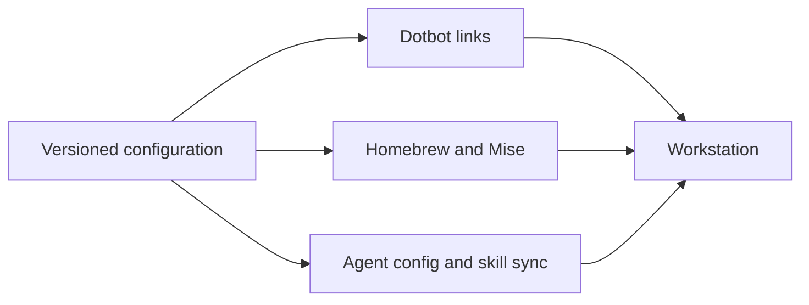

# Dotfiles

A versioned development workstation: shell, Git, tools and AI coding agents configured together.
Built for Apple Silicon macOS, with partial Debian support.

## What you get

- A Zsh environment with completion, aliases, terminal settings and a welcome prompt.
- Explicit package lists: Homebrew for apps and system tools, Mise for development tools.
- Shared instructions and skills for Claude Code, OpenCode, Codex and Oh My Pi, with separate
  ownership for tracked configuration and generated agent assets.
- Local overrides for Git identity, signing and shell settings, so personal values can stay off Git.

## Why keep it together

Review workstation changes like code. Carry the same defaults between machines. Change a tool list
or agent rule in one place, then apply it through the documented installer or sync workflow.

[Set up a workstation](/docs/setup.md)

This is a personal setup, not a universal installer. Review its SSH/AWS defaults before adopting it.
Installation changes home-directory files and the login shell. Full sync can remove packages and
push skill-lockfile commits; the setup guide explains those boundaries before you run anything.

## Explore

| Task | Guide |
| --- | --- |
| Maintain packages and run checks | [Tooling](/docs/tooling.md) |
| Configure agents, instructions and skills | [Coding agents](/docs/coding-agents.md) |
| Change shell behavior | [Zsh configuration](/docs/zsh-configuration.md) |
| Set Git identity and signing | [Git configuration](/docs/git-configuration.md) |
| Use editable UI designs | [Agent UI design tools](/docs/agent-ui-design-tools.md) |
| Inspect installation and update behavior | [Scripts](/scripts/README.md) |
