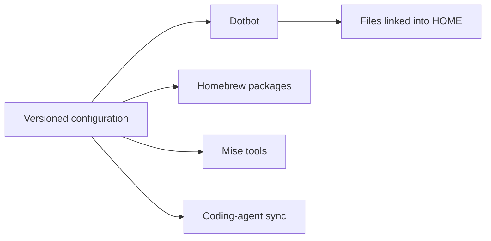

# Dotfiles

Keep your shell, Git, development tools, and AI coding agents in version control.

Waldo's personal workstation configuration for macOS and Debian. Browse the pieces you need,
or adapt the setup to manage your own machine.

[Start with the setup guide](/docs/setup.md)

## What you get

- **A shared shell setup:** Zsh configuration, aliases, completion, and terminal settings that
  travel with the repository.
- **Explicit tool choices:** Homebrew manages apps and system packages; Mise manages development
  tools and global versions, with project-level overrides.
- **Configured coding agents:** Settings, instructions, skills, and integrations for Claude Code,
  Codex, OpenCode, and OMP, with documentation of what each sync owns.
- **Room for local differences:** Keep Git identity, signing preferences, and machine-specific shell
  settings outside the tracked configuration.

## Why keep it together

Review configuration changes in Git. See which packages belong on the machine. Keep agent
instructions alongside the tools they govern. A shared sync workflow applies those choices
without rebuilding the setup by hand.

This is an opinionated personal setup. Installation changes files in your home directory and the
login shell. Full sync can remove Homebrew packages absent from the Brewfile. Review the
[setup guide](/docs/setup.md) before adopting it; some desktop apps are macOS-only.

## Explore the setup

| Choose what you need | Read |
| --- | --- |
| Set up a machine | [Installation and local configuration](/docs/setup.md) |
| Maintain tools and packages | [Sync workflow and tooling](/docs/tooling.md) |
| Understand shell behavior | [Zsh configuration](/docs/zsh-configuration.md) |
| Configure Git identity and signing | [Git configuration](/docs/git-configuration.md) |
| Work with AI coding agents | [Agent configuration and skills](/docs/coding-agents.md) |
| Build frameworkless web apps and design systems | [Web standards skill](/home/.agents/skills/web-standards/SKILL.md) |
| Inspect the automation | [Utility scripts](/scripts/README.md) |
